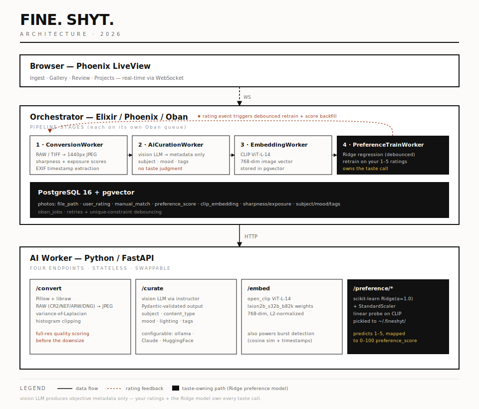

# FINE. SHYT.

I take photos. Mostly macro, mostly botanical, mostly black and white, mostly things other people walk past without a second look. After a while you accumulate a lot of TIFFs and an existential question: which of these are actually good and which am I just emotionally attached to because I spent 45 minutes on my knees in the dirt to get the shot.

This project is my answer to that question. I described my own aesthetic to an AI and let it go through my archive and tell me what fits. Fine shyt, if you will.

It's also an excuse to get back into ML. The last time I did anything in this space was [deploying a transformer model in 2021](https://qwelian.com/posts/Deploying_Transformer_Models). Which like in AI years, is basically the Jurassic period. A lot has changed. Vision models that can actually reason about composition and aesthetic? That's new and worth playing with.



## How this changed

The first version of this project asked a vision LLM (LLaVA, via Ollama) to decide whether each photo "matched my style." You wrote a prose description of your aesthetic, the model compared the photo to it, and spat out a match/no-match verdict plus a style_score.

That worked. Sort of. But text prompts are a lossy way to describe a visual style, and LLaVA's read of "moody black-and-white macro" drifted from my read of it. My star ratings didn't feed back into the system; the model's verdict and my verdict lived on parallel tracks.

So the architecture flipped. The vision LLM now does objective metadata only. Every photo gets a CLIP embedding, and a Ridge regression linear probe is trained on your star ratings. So the more you rate, the more `preference_score` drifts toward what you actually like. The MATCH badge is now driven by that personalized score, not by anyone's prose description. See [Photos.match_threshold/0](orchestrator/lib/orchestrator/photos.ex).

## What it does

You point it at a directory on your hard drive. I've got about a TB of TIFFs on an external drive that had never been properly sorted. It randomly samples N files, converts whatever it finds down to workable JPEGs, and runs each one through the pipeline.

Results go into a gallery. You can filter by match, no match, or everything. The whole thing updates in real-time while the jobs run. 

The vision LLM's only job is objective metadata: subject, content type, mood, lighting critique, tags. It is deliberately *not* asked to judge style because that job belongs to you and the preference model. As you rate photos (1-5 stars), a CLIP embedding is computed for every photo and a Ridge regression model trained on your ratings produces a `preference_score` in [0, 100] that drifts toward what you actually like. The gallery's MATCH badge fires when `preference_score >= Photos.match_threshold()` (currently 70, sitting just under the median of 5★ photos). You can also chef's-pick any photo by hand with the `manual_match` flag — that override surfaces as a distinct "★ Chef's Pick" badge and always counts as a match regardless of the numeric score.

Technical quality scoring runs during conversion. Sharpness (variance-of-Laplacian) and exposure (histogram clipping) are computed on the full-resolution source before it gets downsized, so you can sort and filter independent of style. This is still buggy and doesnt produce the best results for me but it is useful potentially for identifying technically sound photographs.

Burst detection groups visually similar photos taken within seconds of each other (CLIP cosine similarity + EXIF timestamps), highlights the sharpest frame, and lets you keep-best-reject-rest in one click.

After you've rated enough photos you start to see clusters. You assign project names manually in the gallery. Then you export the approved ones to your blog.

Single image curation still works too, at `/`. Drop a photo, get a museum placard back.

## Architecture

**The Orchestrator** (`/orchestrator`) — Elixir, Phoenix LiveView, Oban, PostgreSQL + pgvector. This is the main service. It owns the UI, the job queue, the database, and the pub/sub fanout that makes the real-time updates work. Oban handles retries with backoff so a slow inference call doesn't just silently disappear. Background workers handle the pipeline: conversion, AI curation, CLIP embedding, preference model training, and burst detection are each on its own queue with appropriate concurrency limits.

**The AI Worker** (`/ai_worker`) — Python, FastAPI, Instructor, open_clip, scikit-learn. This is the AI microservice. Though it does takeup like 3GB of RAM. It gets an image over HTTP, encodes it to base64, asks the vision model what it sees, and enforces the response into a strict Pydantic schema via `instructor`. It also handles conversion (RAW/TIFF to JPEG with quality scoring), CLIP embedding (ViT-L-14, 768-dim), preference model training/scoring (Ridge regression linear probe), and burst detection (cosine similarity + temporal clustering).

## The pipeline

When you import a photo, here's what happens:

1. **ConversionWorker** — opens the source file (RAW, TIFF, whatever), computes sharpness/exposure scores on the full-res image, extracts EXIF timestamps, resizes to 1440px JPEG.
2. **AiCurationWorker** — sends the JPEG to the vision LLM for subject, content type, mood, lighting critique, and tag suggestions. No style/taste judgment.
3. **EmbeddingWorker** — computes a 768-dim CLIP image embedding, stores it in pgvector.
4. **PreferenceTrainWorker / PreferenceScoreWorker** — after the embedding lands, the pipeline forks. If the photo already has a star rating, it becomes a new training sample and `PreferenceTrainWorker` (debounced to one run per 5 min) refits the Ridge model and backfills `preference_score` across the archive. If the photo is unrated, a much cheaper `PreferenceScoreWorker` just scores it against the existing model — no retrain. This keeps batch imports of hundreds of unrated photos from triggering hundreds of pointless retrains.

Each step is a separate Oban job. Failures retry independently without blocking the rest of the pipeline.

## Design

This is how I think about the architecture — a RADIO breakdown (**R**equirements, **A**rchitecture, **D**ata model, **I**nterface, **O**ptimizations). Non-trivial changes to how the pieces talk to each other get argued in this frame before they ship. If a proposal doesn't fit one of the five boxes, it's probably a feature, not a design change.

### R — Requirements

**Problem:** curate ~1TB of botanical/macro TIFFs and surface the ones that match my aesthetic, not a generic one.

**Scoping decisions, and the tradeoff behind each:**

- **Single-user, local-first.** No multi-tenant auth, no cloud sync. Runs on one machine.
- **The user owns the taste call, not the LLM.** LLM produces objective metadata only; a model trained on my star ratings owns the aesthetic verdict.
- **Real-time UI.** The gallery updates as background jobs finish, rather than rendering a batch after the whole import completes.
- **Inputs:** TIFF / JPEG / PNG / WebP + camera RAW (CR2 / CR3 / NEF / ARW / DNG).
- **Failures are per-photo, not per-batch.** Every pipeline step is its own Oban job with independent retries.
- **Output:** a live gallery for browsing and a blog export (`photos.json` manifest).

**Explicit non-goals:** multi-user auth, cloud sync, training a bespoke vision model from scratch.

### A — Architecture

Two services plus infrastructure, decoupled by a Postgres-backed job queue.

**1. Orchestrator ([orchestrator/](orchestrator/))** — Elixir / Phoenix LiveView / Oban / Postgres + pgvector. Owns the UI, DB, job queue, and pub/sub fanout. Workers live in [orchestrator/lib/orchestrator/workers/](orchestrator/lib/orchestrator/workers/):

- `ConversionWorker` → RAW/TIFF → 1440px JPEG + sharpness / exposure
- `AiCurationWorker` → vision-LLM metadata
- `EmbeddingWorker` → CLIP embedding, then forks to either train or score
- `PreferenceTrainWorker` → Ridge retrain (debounced to 5 min)
- `PreferenceScoreWorker` → score a single photo without retraining
- `BurstDetectionWorker` → near-duplicate grouping
- `LocalBatchImportWorker` → directory walk

**2. AI Worker ([ai_worker/src/fineshyt_ai/](ai_worker/src/fineshyt_ai/))** — Python / FastAPI / Instructor / open_clip / scikit-learn. Stateless inference service split along a transport/domain seam: every ML op is a plain function in `domain/`, and `transports/http/` is the thin FastAPI layer that marshals them. LLM-agnostic (LLaVA / Claude / Llama via `LLM_BASE_URL`). Holds CLIP (ViT-L-14, 768-dim) in process memory and a pickled Ridge preference model at `~/.fineshyt/preference_model.pkl`.

**3. Infrastructure:** Postgres 16 + pgvector (Docker), on-disk JPEGs under `priv/static/uploads/`.

**Flow:** import → Oban fans out a per-photo job chain → orchestrator calls the AI worker over HTTP → writes results back → LiveView pushes the update.

### D — Data Model

The `photos` table in [orchestrator/lib/orchestrator/photos/photo.ex:57-81](orchestrator/lib/orchestrator/photos/photo.ex#L57-L81) is the single aggregate — everything about a photo lives on one row, owned by the orchestrator:

| Field group   | Fields                                                                                      | Written by                                       |
|---------------|---------------------------------------------------------------------------------------------|--------------------------------------------------|
| Identity      | `file_path`, `url`, `source`                                                                | Orchestrator on ingest                           |
| Tech quality  | `technical_score`, `sharpness_score`, `exposure_score`                                      | AI Worker `/convert` + `/quality_scores`         |
| Semantic      | `clip_embedding` (pgvector, 768-dim)                                                        | AI Worker `/embed`                               |
| Taste         | `preference_score` (0-100), `preference_model_version`, `user_rating` (1-5), `manual_match` | Ridge via `/preference/score`; user via LiveView |
| LLM metadata  | `subject`, `content_type`, `artistic_mood`, `lighting_critique`, `suggested_tags[]`         | AI Worker `/curate`                              |
| Organization  | `project`, `burst_group`, `captured_at`                                                     | User + `BurstDetectionWorker`                    |
| Lifecycle     | `curation_status`, `failure_reason`                                                         | Oban workers                                     |

**Other persisted state:**

- `oban_jobs` — queue state, orchestrator-only.
- `error_logs` — every worker failure, retained for the `/logs` LiveView.
- `~/.fineshyt/preference_model.pkl` — `{model, scaler, version, clip_model, embed_dim}`, worker-local.

### I — Interface

Elixir ↔ Python, HTTP + JSON, all POST:

| Endpoint                    | Input                                           | Output                                                 | Caller                                             |
|-----------------------------|-------------------------------------------------|--------------------------------------------------------|----------------------------------------------------|
| `/api/v1/convert`           | `{file_path}`                                   | `{jpeg_path, sharpness, exposure, captured_at}`        | `ConversionWorker`                                 |
| `/api/v1/curate`            | multipart `file`                                | `PhotoMetadata`                                        | `AiCurationWorker`                                 |
| `/api/v1/embed`             | `{file_path}`                                   | `{embedding[768], model, dim}`                         | `EmbeddingWorker`                                  |
| `/api/v1/preference/train`  | `{samples[{embedding, rating}], min_samples}`   | `{model_version, n_samples, train_r2}`                 | `PreferenceTrainWorker`                            |
| `/api/v1/preference/score`  | `{embeddings[][]}`                              | `{scores[0-100], model_version}`                       | `PreferenceTrainWorker`, `PreferenceScoreWorker`   |
| `/api/v1/exif`              | `{file_path}`                                   | `{captured_at}`                                        | backfill task                                      |
| `/api/v1/quality_scores`    | `{file_path}`                                   | `{sharpness, exposure}`                                | backfill task                                      |
| `/api/v1/detect_bursts`     | `{photos[{id, embedding, captured_at}]}`        | `{groups[]}`                                           | `BurstDetectionWorker`                             |

Errors are funneled through a structured payload — `{op, error_type, message, context, upstream?}` — with `openai.APIError` unwrapped so upstream status codes (404 / 413 / 429 / 503) survive the hop. The Elixir side parses the body in `AiCurationWorker.format_api_error/1`, records it in `error_logs`, and decides whether to retry.

**User ↔ Orchestrator:** Phoenix LiveView at `/` (single-upload), `/gallery` (archive / rate / filter / chef's-pick / burst keep-reject / project assignment / export), and `/logs` (live error stream).

### Operational ugliness (a sub-note on I)

This is where the operational ugliness has to stay visible. `_status_for` and `_error_detail` on the Python side unwrap `openai.APIError` so upstream codes — 404 model-not-found, 413 payload-too-large, 429 rate-limited — survive the hop to Elixir as structured payloads ([ai_worker/src/fineshyt_ai/errors.py](ai_worker/src/fineshyt_ai/errors.py)); `AiCurationWorker.format_api_error/1` parses them back into human sentences, photos land in a `curation_status: "failed"` lane with a populated `failure_reason`, and every worker hands the failure plus its Oban `attempt`/`max_attempts` counters to `ErrorLog.record/1`, itself wrapped in `rescue` so the audit trail can't be taken down by the thing it's auditing ([orchestrator/lib/orchestrator/error_log.ex](orchestrator/lib/orchestrator/error_log.ex)). Inserts broadcast on PubSub to a real-time `/logs` feed. None of that is polish — AI pipelines fail in extremely specific and uninteresting ways (the LLM returns a string where a float should be, `rawpy` segfaults on one RAW in a thousand, Ollama 429s under burst, a worker vanishes mid-inference), and most of the real work here isn't "ask the model, receive magic" but figuring out why outputs are malformed, why a worker is wedged, or why jobs disappeared into the void. The error log belongs in this story because it reflects the actual development experience, not the idealized one.

### O — Optimizations & deep dive

The current bottleneck is synchronous RPC: Oban → FastAPI holds a socket open for the 2–30s of LLM inference, and workers serialize on a single request at a time. Fine for a laptop, wrong shape if this ever needs to scale.

Ranked by learning-per-weekend:

**Pick first — RabbitMQ + the claim-check pattern.**

- Orchestrator publishes `{photo_id, file_path}` to a RabbitMQ queue. The file already lives on shared disk, so we skip Base64 entirely — that's a literal claim check, no S3 needed locally.
- Python workers drop FastAPI and become plain `pika` consumer loops. No web server, no open ports. They pull work; they don't get pushed.
- Results go back to Elixir via an AMQP consumer that updates the DB and broadcasts to LiveView.
- Scaling becomes `docker compose up --scale worker=10`. Backpressure is just "the queue gets long." A worker crash → RabbitMQ redelivers the message. Same architectural shape as telemetry pipelines on Ankaa.

The Python restructure in [ai_worker/src/fineshyt_ai/](ai_worker/src/fineshyt_ai/) was prep work for this. Every `domain/` function is already callable without FastAPI, so the migration is writing a new `transports/queue/` package, not rewriting the ML code.

**Skip for now — gRPC / Protobuf.** Strict contracts are great, but schema churn while iterating on `PhotoMetadata` (it's been reshaped more than once) makes the codegen loop annoying. Revisit once the schema stabilizes.

**Skip — Kafka / raw TCP.** Wrong tool for a solo laptop. You'd be debugging ZooKeeper or hand-rolled frame protocols instead of learning pipelines.

**Other angles worth time once the broker is in:**

- **Native macOS app** — SwiftUI shell over the same orchestrator HTTP API. Real file-system access (no uploads dance) and proper RAW thumbnails via `ImageIO`.
- **ONNX → Core ML for CLIP on-device.** Export ViT-L-14 to Core ML and run embeddings on the Apple Neural Engine. Kills the 3GB Python RAM footprint for the embedding path and makes a native offline app viable.
- **Active learning for ratings.** Surface the photos Ridge is least confident about (closest to the decision boundary) instead of picking randomly. Gets from 20 → 200 rated labels much faster, with better-shaped training data.
- **Replace Ridge with a small MLP head** once there are 200+ ratings. A linear probe flattens out; a 2-layer net on frozen CLIP features can capture non-linear taste curves.
- **Natural-language search** (see *Future work*) — CLIP's text encoder ships in the same checkpoint, so this is a ~50-line endpoint plus a search box, not a research project.

## LLM options

The worker is configured via environment variables so you can point it at whatever you have:

```bash
# Local (default) — needs Ollama running with llava pulled
LLM_BASE_URL=http://localhost:11434/v1/
LLM_API_KEY=ollama
LLM_MODEL=llava

# Claude
LLM_BASE_URL=https://api.anthropic.com/v1/
LLM_API_KEY=sk-ant-...
LLM_MODEL=claude-opus-4-6

# HuggingFace
LLM_BASE_URL=https://api-inference.huggingface.co/v1/
LLM_API_KEY=hf_...
LLM_MODEL=meta-llama/Llama-3.2-11B-Vision-Instruct
```

Local inference is free and private but will make your fans spin. 

## Ingesting photos

Point it at a directory. It walks recursively and picks up TIFF, JPEG, PNG, WebP, and camera RAW files (CR2, CR3, NEF, ARW, DNG, etc.). RAW support comes from `rawpy`, which wraps `libraw`. Whether you need to install libraw separately depends on your platform:

```bash
# macOS — Apple Silicon wheels don't always bundle libraw cleanly,
# so the safe move is to install it via Homebrew.
brew install libraw

# Linux — install the dev package, or rely on the manylinux wheel
# (which usually bundles libraw statically).
sudo apt install libraw-dev          # Debian / Ubuntu
sudo dnf install LibRaw-devel        # Fedora

# Windows — nothing to install. The `win_amd64` rawpy wheel bundles
# libraw statically. `uv sync` pulls it down and you're done.
```

Set `STATIC_UPLOADS_DIR` in `ai_worker/.env` to point at the orchestrator's static uploads folder:

```bash
STATIC_UPLOADS_DIR=/path/to/fineshyt/orchestrator/priv/static/uploads
```

## Backfill tasks

For existing photos that predate a feature, there are one-shot mix tasks:

```bash
cd orchestrator

# CLIP embeddings for all photos missing them
mix fineshyt.embed_backfill

# Sharpness/exposure scores (from converted JPEGs, or originals for better accuracy)
mix fineshyt.quality_backfill
mix fineshyt.quality_backfill --source /Volumes/Photos/originals

# EXIF timestamps (needs originals — converted JPEGs have EXIF stripped)
mix fineshyt.exif_backfill --source /Volumes/Photos/originals
```

## Blog export

When you've rated enough and the projects have names, export the approved photos:

```bash
cd orchestrator && mix fineshyt.export --target /path/to/blog/photos
```

Approved means you've rated it *and* one of: rating ≥ 4, chef's-picked, or `preference_score` meets the match threshold. Unrated photos never export — the whole point is that you had an opinion about it first. Export is additive, existing files don't get touched, and a `photos.json` manifest gets written alongside the images with filename, tags, mood, `preference_score`, `user_rating`, `manual_match`, and project name. Your blog reads from that.

## Running it

Two install paths. Pick whichever matches how you want to use the app.

### Option 1: Docker Compose (easiest, recommended for non-developers)

Prerequisites: [Docker Desktop](https://www.docker.com/products/docker-desktop/) and [Ollama](https://ollama.com/download).

**macOS / Linux / WSL** (Git Bash + make on Windows works too):

```bash
git clone https://github.com/qweliant/fineshyt.git
cd fineshyt
make compose
```

`make compose` creates `.env` from the template, generates a `SECRET_KEY_BASE` for you, and brings everything up. The first run will fail with a message asking you to set `PHOTO_LIBRARY` in `.env` — point it at the folder where your photos live, then re-run.

**Manual flow** (no make required, works in any shell):

```bash
git clone https://github.com/qweliant/fineshyt.git
cd fineshyt
cp .env.example .env       # then edit .env to set PHOTO_LIBRARY + SECRET_KEY_BASE
docker compose up --build
```

First run is 10–20 minutes (Docker pulls base images, builds the two service containers, the AI worker fetches its CLIP encoder ~2 GB). Subsequent runs start in seconds.

In compose mode your photo library is bind-mounted read-only at `/photos` inside the containers, so the gallery's Directory field takes paths like `/photos/2024-spring` regardless of where the host folder actually lives.

Photographers without a developer background should follow the [photographer's Windows install guide](https://qweliant.github.io/fineshyt/install-windows.html) — same install, more screenshots and hand-holding.

### Option 2: Native dev install (for hacking on the code)

Prerequisites: [Mise](https://mise.jdx.dev/), [uv](https://github.com/astral-sh/uv), [Docker](https://www.docker.com/) (just for Postgres+pgvector).

First time:

```bash
make setup
```

Every time after that:

```bash
make dev
```

- Gallery + single upload: [localhost:4000](http://localhost:4000)
- AI worker API docs: [localhost:8000/docs](http://localhost:8000/docs)

## Running on Windows

The whole stack — BEAM, Python, Postgres, pgvector, Ollama — works on Windows. Two paths, pick one. WSL2 is the smoother one because the Makefile and the rest of this repo assume bash; native Windows works but you skip the Makefile and run the underlying commands by hand.

### Path A: WSL2 (recommended)

This is the easy mode. Everything in this README above just works because it's Linux underneath.

1. **Install WSL2 with Ubuntu.** PowerShell as admin:

   ```powershell
   wsl --install -d Ubuntu
   ```

   Reboot when it asks.

2. **Install Docker Desktop for Windows** and turn on the WSL2 backend (Settings → Resources → WSL Integration → enable for your Ubuntu distro). Containers from inside Ubuntu now hit Docker on the host.

3. **Inside the Ubuntu shell**, install the toolchain:

   ```bash
   # mise — manages Erlang/Elixir/Node versions
   curl https://mise.run | sh
   echo 'eval "$(~/.local/bin/mise activate bash)"' >> ~/.bashrc
   exec bash

   # uv — manages Python + the ai_worker venv
   curl -LsSf https://astral.sh/uv/install.sh | sh

   # libraw + build tools (RAW decoding + native compiles)
   sudo apt update
   sudo apt install -y build-essential libraw-dev make
   ```

4. **Clone the repo inside the Linux filesystem** (e.g. `~/code/fineshyt`), not under `/mnt/c/...`. File watching across the WSL/Windows boundary is slow and flaky; keeping the working tree on the Linux side avoids both.

5. **Ollama.** Install [Ollama for Windows](https://ollama.com/download) on the host. From WSL it's reachable at `http://host.docker.internal:11434` or `http://localhost:11434` if you've enabled WSL's localhost forwarding (default on recent Windows). Then in `ai_worker/.env`:

   ```bash
   LLM_BASE_URL=http://host.docker.internal:11434/v1/
   LLM_API_KEY=ollama
   LLM_MODEL=llava
   ```

   Pull the model once: `ollama pull llava`.

6. **Run it.** From there it's identical to macOS — `make setup` then `make dev`.

### Path B: Native Windows (no WSL)

Doable, but you'll be running commands by hand instead of `make`, and the Browse button in the gallery won't work (it shells out to AppleScript). Paste paths into the Directory field instead.

**Prereqs:**

- [Docker Desktop for Windows](https://www.docker.com/products/docker-desktop/)
- [uv](https://docs.astral.sh/uv/getting-started/installation/) (PowerShell: `irm https://astral.sh/uv/install.ps1 | iex`)
- Erlang + Elixir. Either:
  - the official installers from [erlang.org](https://www.erlang.org/downloads) and [elixir-lang.org](https://elixir-lang.org/install.html#windows), or
  - Scoop: `scoop install erlang elixir`
- [Ollama for Windows](https://ollama.com/download), then `ollama pull llava`
- Python 3.11 or 3.12 — `uv` will handle this for you. Avoid 3.13 until rawpy ships a wheel for it.

**Setup (PowerShell, from the repo root):**

```powershell
# 1. Postgres + pgvector
docker compose up -d

# 2. Elixir side
cd orchestrator
mix local.hex --force
mix local.rebar --force
mix deps.get
mix ecto.setup
cd ..

# 3. Python side — uv pulls the rawpy wheel which bundles libraw,
#    so no separate libraw install is needed.
cd ai_worker
uv sync
cd ..
```

**Configure the AI worker** — create `ai_worker/.env`:

```dotenv
LLM_BASE_URL=http://localhost:11434/v1/
LLM_API_KEY=ollama
LLM_MODEL=llava
STATIC_UPLOADS_DIR=C:\path\to\fineshyt\orchestrator\priv\static\uploads
```

Backslashes are fine; Python's `pathlib` handles either separator.

**Run it.** Two terminals:

```powershell
# terminal 1 — orchestrator
cd orchestrator
mix phx.server
```

```powershell
# terminal 2 — ai worker
cd ai_worker
uv run fastapi dev src/main.py --reload
```

Same URLs as above (`localhost:4000`, `localhost:8000/docs`).

### Known Windows quirks

- **Browse button** uses PowerShell's `FolderBrowserDialog` on Windows, AppleScript on macOS, and `zenity` on Linux (if installed). If you don't have zenity on Linux, the button hides itself — paste a path instead.
- **Quick-access chips** (Desktop / Downloads / Pictures) auto-resolve to the right absolute path per OS, so on Windows they point at `C:\Users\<you>\Desktop` etc. without you having to think about it.
- **File paths get stored in the DB** as whatever absolute path the orchestrator saw at ingest time. Moving the photos directory or changing drive letters after the fact will break the gallery's file references — same gotcha as macOS, but Windows drive letters make it easier to hit.
- **rawpy on Python 3.13.** At time of writing the latest rawpy wheels target up through 3.12. If `uv sync` complains, pin to 3.12: `uv python pin 3.12 && uv sync`.

## Future work

**Perceptual duplicate detection** — Deduplication today is filename-stem based: if `DSC_0042.tiff` and `DSC_0042.jpg` both exist, only one gets ingested. That misses actual visual duplicates across different filenames — re-exports, crops, edits. Perceptual hashing or embedding cosine distance would catch those. The CLIP embeddings are already there; this is mostly a UI/workflow question.

**Natural language search** — pgvector and CLIP embeddings are in place. The missing piece is encoding a text query with CLIP's text encoder and doing a nearest-neighbor search against the photo embeddings. "Find moody portraits with side lighting," "photos like this one but sharper." Infrastructure is ready, just needs the endpoint and a search box.

## Author

Qwelian Tanner — [qwelian.com](https://www.qwelian.com)
